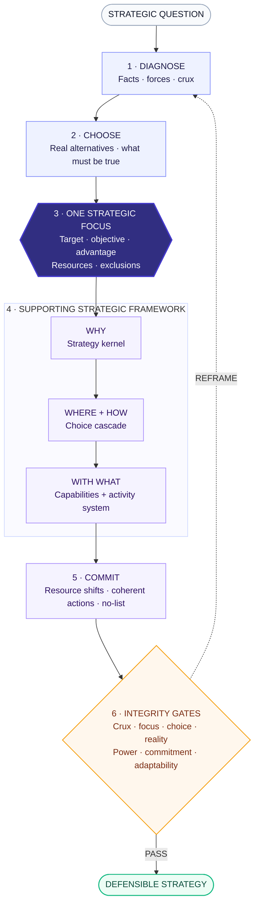

# Formulate Strategy

A strategy-formulation Agent Skill that distills complexity into **one defensible focus**, then aligns choices, capabilities, resources, and action behind it.

## How it works



The Skill combines Rumelt's strategy kernel, Porter's trade-offs and activity fit, Martin's choice cascade, nonlinear strategy lenses inspired by Peter Thiel and Paul Graham, and Zeng Ming's smart-business frameworks. The frameworks support the focus; they never replace it.

## What it produces

- One current Strategic Focus per decision scope
- Diagnosis, crux, alternatives, and strongest dissent
- Strategy kernel, choice cascade, and advantage logic
- Resource commitments, coherent actions, explicit no-list, and invalidation conditions

## Install

```bash
git clone https://github.com/ZepinLi/formulate-strategy.git
mkdir -p ~/.codex/skills
cp -R formulate-strategy/formulate-strategy ~/.codex/skills/
```

## Use

```text
Use $formulate-strategy to identify my single strategic focus and build the choices, trade-offs, capabilities, and coherent actions that support it.
```

See [research provenance](formulate-strategy/references/research-provenance.md) for the methodological sources and their limitations.

MIT licensed.
